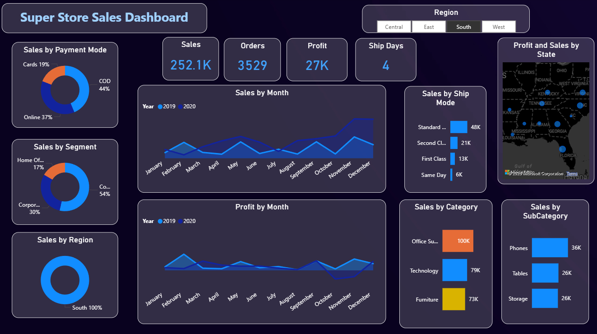
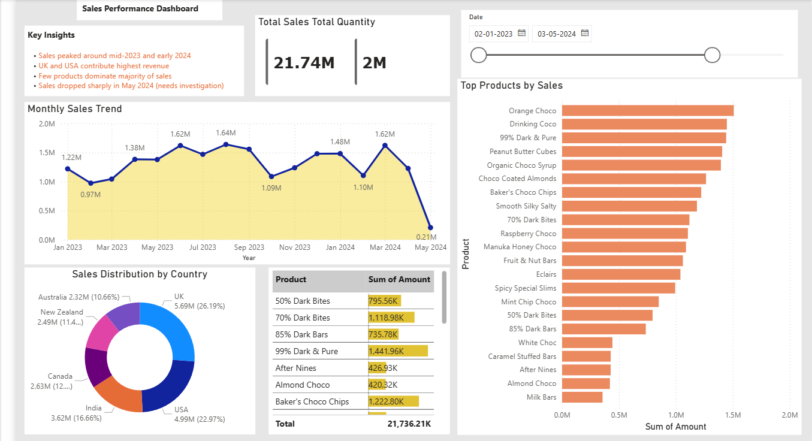
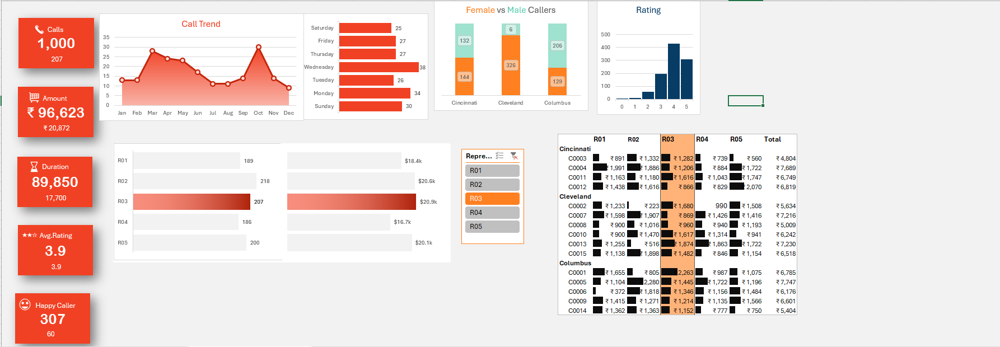

<div align="center">

# Charu Sharma

### Data Analyst Portfolio

**Power BI | Advanced Excel | SQL | Python | Data Visualization | Business Reporting**

[](https://www.linkedin.com/in/charu-sharma-25a8923a0/)
[](https://github.com/CharuAnalyst)
[](mailto:sharmacharu32004@gmail.com)

</div>

---

## Overview

Welcome to my Data Analyst portfolio. This repository showcases hands-on analytics projects built using **Power BI, Advanced Excel, SQL, and Python**.

My focus is on cleaning raw datasets, building interactive dashboards, tracking business KPIs, and presenting insights that support better decision-making. The projects in this portfolio cover sales performance, retail analytics, call center operations, and business reporting.

---

## Skills Snapshot

| Area | Tools & Skills |
| --- | --- |
| Business Intelligence | Power BI, DAX, Data Modeling, Interactive Dashboards |
| Excel Analytics | Advanced Excel, Pivot Tables, Power Query, Slicers, Charts |
| Programming | Python, Pandas, NumPy, Data Handling |
| Database | SQL, Joins, Aggregations, Filtering, Reporting Queries |
| Analytics Workflow | Data Cleaning, KPI Tracking, Trend Analysis, Data Visualization, Reporting |
| Business Focus | Sales Analysis, Operational Reporting, Customer Performance, Dashboard Storytelling |

---

## Featured Projects

| Project | Tools | Focus Area | Link |
| --- | --- | --- | --- |
| Superstore Sales Dashboard | Power BI, DAX | Sales, profit, category, region, shipping analysis | [View Project](Superstore-Dashboard) |
| Sales Performance Dashboard | Power BI, DAX | Revenue trends, product performance, country-wise sales | [View Project](Sales-Performance-Dashboard) |
| Call Center Performance Dashboard | Excel | Call volume, customer ratings, agent workload, operations | [View Project](Call-Center-Dashboard) |

---

## Project Case Studies

### 1. Superstore Sales Dashboard



**Tools Used:** Power BI, DAX, Data Modeling, Dashboard Design

**Business Goal:**  
Analyze sales, profit, orders, regional performance, product categories, and shipping behavior to understand retail performance and support business decisions.

**Dashboard Highlights**
- KPI cards for total sales, orders, profit, and ship days
- Monthly sales and profit trend analysis
- Category and sub-category performance tracking
- Sales breakdown by segment, payment mode, region, and shipping mode
- Region-based filtering for focused business review

**Key Insights**
- Technology and office supplies showed strong sales contribution.
- Regional filtering helps compare market performance more clearly.
- Some high-sales areas require deeper profit analysis to avoid low-margin decisions.

**Project Files**
- [Project README](Superstore-Dashboard/README.md)
- [Power BI File](Superstore-Dashboard/superstore_dashboard.pbix)
- [Dashboard Image](Superstore-Dashboard/dashboard.png)

---

### 2. Sales Performance Dashboard



**Tools Used:** Power BI, DAX, Data Visualization, KPI Reporting

**Business Goal:**  
Track sales performance across countries, products, and time periods to identify revenue trends, top products, and market contribution.

**Dashboard Highlights**
- KPI cards for total sales and total quantity
- Monthly sales trend analysis
- Top products by sales
- Sales distribution by country
- Date slicer for time-based analysis
- Key insights section inside the dashboard

**Key Insights**
- UK and USA contributed the highest revenue.
- A small set of products generated a major share of total sales.
- Sales dropped sharply around May 2024, which needs further business investigation.

**Project Files**
- [Project README](Sales-Performance-Dashboard/README.md)
- [Power BI File](Sales-Performance-Dashboard/sales_dashboard.pbix)
- [Dashboard Image](Sales-Performance-Dashboard/dashboard.png)

---

### 3. Call Center Performance Dashboard



**Tools Used:** Advanced Excel, Pivot Tables, Slicers, Charts, Data Cleaning

**Business Goal:**  
Monitor call center performance using call volume, amount generated, call duration, customer ratings, agent workload, and caller trends.

**Dashboard Highlights**
- KPI cards for calls, amount, duration, rating, and happy callers
- Monthly call trend analysis
- Day-wise call distribution
- Agent/representative-wise performance tracking
- Gender and city-level caller comparison
- Customer rating distribution

**Key Insights**
- Mid-week days showed higher call activity.
- Customer ratings varied across caller groups and operational segments.
- Agent-level tracking helps understand workload distribution and performance patterns.

**Project Files**
- [Project README](Call-Center-Dashboard/README.md)
- [Excel Dashboard File](Call-Center-Dashboard/Call_center_project.xlsx)
- [Dashboard Image](Call-Center-Dashboard/dashboard.png)

---

## Repository Structure

```text
data-analyst-portfolio/
├── Superstore-Dashboard/
│   ├── README.md
│   ├── dashboard.png
│   └── superstore_dashboard.pbix
├── Sales-Performance-Dashboard/
│   ├── README.md
│   ├── dashboard.png
│   └── sales_dashboard.pbix
├── Call-Center-Dashboard/
│   ├── README.md
│   ├── dashboard.png
│   └── Call_center_project.xlsx
└── README.md
