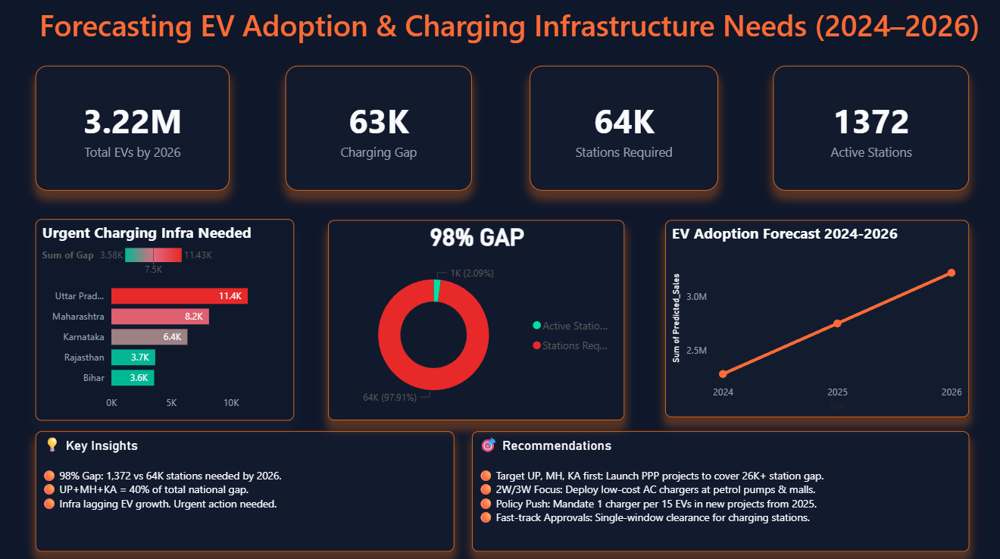
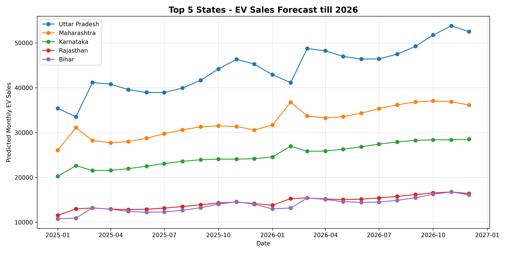
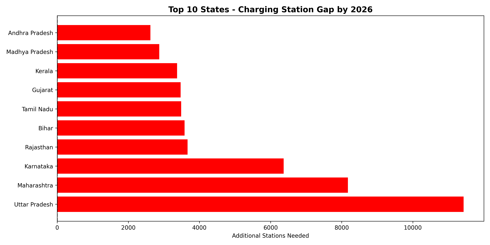

<div align="center">

# Charu Sharma

### Data Analyst Portfolio

**Power BI | Advanced Excel | SQL | Python | Data Visualization | Business Reporting**

[](https://charuanalyst.vercel.app)
[](https://www.linkedin.com/in/charu-sharma-25a8923a0/)
[](https://github.com/CharuAnalyst)
[](mailto:sharmacharu32004@gmail.com)

</div>

---

<div align="center">

## Portfolio Dashboard Preview



</div>

---

## Overview

This repository showcases hands-on **Data Analyst projects** built using **Power BI, Advanced Excel, SQL, and Python**.

The focus of this portfolio is to show practical analytics work: cleaning raw datasets, building KPI dashboards, preparing analysis-ready outputs, identifying trends, and presenting insights that support business decision-making.

The strongest project in this portfolio is the **EV Infrastructure Gap Analysis 2026**, which combines Python-based data preparation with Power BI dashboard reporting.

---

## Recruiter Quick Scan

| What I Demonstrate | Evidence In This Portfolio |
| --- | --- |
| Dashboard Development | Power BI and Excel dashboards with KPIs, slicers, trend visuals, and business summaries |
| Python Data Preparation | EV project includes cleaned datasets, forecast outputs, and gap analysis CSV files |
| Business Thinking | Each project answers a business question instead of only showing charts |
| Reporting Skills | Dashboards are supported with project README files, insights, and recommendations |
| Entry-Level Readiness | Practical projects across EV infrastructure, retail sales, revenue analysis, and call center operations |

---

## Skills Snapshot

| Area | Tools & Skills |
| --- | --- |
| Business Intelligence | Power BI, DAX, Data Modeling, KPI Cards, Interactive Dashboards |
| Excel Analytics | Advanced Excel, Pivot Tables, Power Query, Slicers, Charts, Conditional Formatting |
| Programming | Python, Pandas, NumPy, Data Cleaning, CSV Output Generation |
| SQL | Joins, Aggregations, Filtering, Reporting Queries, Business Analysis Queries |
| Analytics Workflow | Data Cleaning, KPI Tracking, Trend Analysis, Data Visualization, Insight Writing |
| Business Reporting | Sales Analysis, Operational Reporting, Customer Performance, Dashboard Storytelling |

---

## Featured Projects

| Priority | Project | Tools | Business Focus |
| --- | --- | --- | --- |
| 1 | [EV Infrastructure Gap Analysis 2026](EV-Infrastructure-Dashboard) | Python, Power BI | EV adoption forecasting, charging station gap analysis, infrastructure planning |
| 2 | [Superstore Sales Dashboard](Superstore-Dashboard) | Power BI, DAX | Sales, profit, category, region, payment mode, shipping analysis |
| 3 | [Sales Performance Dashboard](Sales-Performance-Dashboard) | Power BI, DAX | Revenue trend, country contribution, product concentration, period review |
| 4 | [Call Center Performance Dashboard](Call-Center-Dashboard) | Advanced Excel | Call volume, customer ratings, workload, operations monitoring |

---

# Project Case Studies

## 1. EV Infrastructure Gap Analysis 2026

**Tools Used:** Python, Pandas, NumPy, Power BI, Data Cleaning, Forecasting Preparation, CSV Output Generation

**Business Goal:**  
Analyze EV adoption and charging station availability across Indian states to identify infrastructure gaps and support 2026 planning decisions.

### Dashboard & Analysis Preview

<div align="center">

<table>
  <tr>
    <td width="34%" align="center">
      
      <br>
      <b>Power BI Dashboard</b>
    </td>
    <td width="33%" align="center">
      
      <br>
      <b>EV Forecast Output</b>
    </td>
    <td width="33%" align="center">
      
      <br>
      <b>Charging Gap Analysis</b>
    </td>
  </tr>
</table>

</div>

### Dashboard Snapshot

| Metric | Value | Meaning |
| --- | ---: | --- |
| Total EVs by 2026 | **3.22M** | Forecasted EV adoption scope |
| Charging Gap | **63K** | Visible gap between required and active stations |
| Stations Required | **64K** | Estimated charging station need |
| Active Stations | **1,372** | Current active station count in the dashboard view |

### What This Project Shows

- Python-based data cleaning and preparation
- Forecasting-ready EV adoption output
- Charging station gap analysis by state
- Power BI dashboard for executive-level infrastructure planning
- Business recommendations for high-priority regions

### Key Insights

- Uttar Pradesh, Maharashtra, and Karnataka appear as high-priority states for EV charging infrastructure planning.
- The dashboard shows a large visible gap between active and required charging stations.
- Forecasting output connects future EV adoption with charging infrastructure demand.
- The project demonstrates both technical preparation and business reporting judgment.

### Project Files

- [Project README](EV-Infrastructure-Dashboard/README.md)
- [Power BI Dashboard](EV-Infrastructure-Dashboard/Outputs/EV_Dashboard.pbix)
- [Dashboard Screenshot](EV-Infrastructure-Dashboard/Outputs/EV_Dashboard_Screenshot.png)
- [EV Forecast CSV](EV-Infrastructure-Dashboard/Outputs/EV_Forecast_2026.csv)
- [EV Gap Analysis CSV](EV-Infrastructure-Dashboard/Outputs/EV_Gap_Analysis_2026.csv)
- [Master Dataset](EV-Infrastructure-Dashboard/Outputs/EV_Master_Data.csv)

---

## 2. Superstore Sales Dashboard


**Tools Used:** Power BI, DAX, Data Modeling, Dashboard Design

**Business Goal:**  
Analyze sales, profit, orders, regional performance, product categories, payment behavior, and shipping patterns to understand retail performance.

### Dashboard Highlights

- KPI cards for total sales, orders, profit, and ship days
- Monthly sales and profit trend analysis
- Category and sub-category performance tracking
- Sales breakdown by segment, payment mode, region, and shipping mode
- Region-based filtering for focused business review

### Key Insights

- Office Supplies, Technology, and Furniture appear as major category groups in the selected dashboard view.
- Regional filtering helps compare market performance more clearly.
- Sales and profit should be reviewed together because high sales may still hide low-margin performance.

### Project Files

- [Project README](Superstore-Dashboard/README.md)
- [Power BI File](Superstore-Dashboard/superstore_dashboard.pbix)
- [Dashboard Image](Superstore-Dashboard/dashboard.png)

---

## 3. Sales Performance Dashboard


**Tools Used:** Power BI, DAX, Data Visualization, KPI Reporting

**Business Goal:**  
Track sales performance across countries, products, and time periods to identify revenue trends, top products, market contribution, and sudden performance changes.

### Dashboard Highlights

- KPI cards for total sales and total quantity
- Monthly sales trend analysis
- Top products by sales
- Sales distribution by country
- Date slicer for time-based review
- Key insights panel inside the dashboard

### Key Insights

- UK and USA appear as strong visible revenue contributors.
- A small set of products generates a major share of total sales.
- The May 2024 drop should be validated before calling it a true sales decline because it may reflect partial-period data.

### Project Files

- [Project README](Sales-Performance-Dashboard/README.md)
- [Power BI File](Sales-Performance-Dashboard/sales_dashboard.pbix)
- [Dashboard Image](Sales-Performance-Dashboard/dashboard.png)

---

## 4. Call Center Performance Dashboard


**Tools Used:** Advanced Excel, Pivot Tables, Slicers, Charts, Conditional Formatting

**Business Goal:**  
Monitor call center performance using call volume, amount generated, call duration, customer ratings, agent workload, caller groups, and operational trends.

### Dashboard Highlights

- KPI cards for calls, amount, duration, rating, and happy callers
- Monthly call trend analysis
- Day-wise call distribution
- Agent or representative workload tracking
- Gender and city-level caller comparison
- Customer rating distribution

### Key Insights

- Mid-week days show higher visible call activity.
- Customer ratings vary across caller groups and operational segments.
- Agent-level tracking helps understand workload distribution and service performance.

### Project Files

- [Project README](Call-Center-Dashboard/README.md)
- [Excel Dashboard File](Call-Center-Dashboard/Call_center_project.xlsx)
- [Dashboard Image](Call-Center-Dashboard/dashboard.png)

---

## Repository Structure

```text
data-analyst-portfolio/
├── EV-Infrastructure-Dashboard/
│   ├── README.md
│   ├── Outputs/
│   │   ├── EV_Dashboard.pbix
│   │   ├── EV_Dashboard_Screenshot.png
│   │   ├── EV_Forecast_2026.csv
│   │   ├── EV_Gap_Analysis_2026.csv
│   │   ├── EV_Master_Data.csv
│   │   ├── Station_Gap_Analysis.png.png
│   │   └── Top5_States_Forecast.png.png
│   └── Scripts/
├── Superstore-Dashboard/
│   ├── README.md
│   ├── dashboard.png
│   └── superstore_dashboard.pbix
├── Sales-Performance-Dashboard/
│   ├── README.md
│   ├── dashboard.png
│   └── sales_dashboard.pbix
├── Call-Center-Dashboard/
│   ├── README.md
│   ├── dashboard.png
│   └── Call_center_project.xlsx
└── README.md
